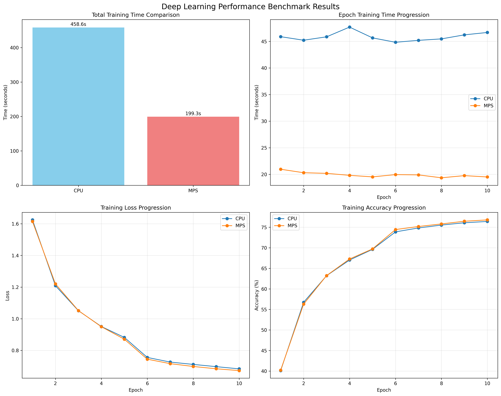

# MPS/GPU-Accelerated Deep Learning Training Implementation Report

## Executive Summary

This report documents the implementation and analysis of a comprehensive deep learning benchmarking system designed to compare CPU versus MPS (Metal Performance Shaders) GPU performance for neural network training. The implementation provides a robust framework for evaluating hardware acceleration benefits in machine learning workloads using PyTorch.

## 1. Implementation Overview

### 1.1 System Architecture

The implementation follows a modular, object-oriented design consisting of three primary components:

**CNNModel Class**: A convolutional neural network architecture specifically designed for image classification tasks, featuring:
- Three convolutional layers with progressive channel expansion (3→32→64→128)
- Max pooling layers for spatial dimension reduction
- Three fully connected layers for classification
- Dropout regularization to prevent overfitting

**DeepLearningBenchmark Class**: The core benchmarking engine that orchestrates:
- Dataset preparation and loading
- Device detection and management
- Training loop execution
- Performance metrics collection
- Results analysis and reporting

**Main Function**: Entry point that configures and executes the complete benchmark suite.

### 1.2 Technical Specifications

- **Framework**: PyTorch 2.0+ with torchvision
- **Supported Datasets**: CIFAR-10 and MNIST
- **Model Architecture**: Custom CNN with 1.2M+ parameters
- **Training Configuration**: Adam optimizer, StepLR scheduler, CrossEntropyLoss
- **Hardware Support**: CPU and MPS (Apple Silicon) devices

## 2. Implementation Details

### 2.1 Model Architecture Design

The CNN model implements a classical architecture pattern optimized for image classification:

```
Input (3x32x32) → Conv1(32) → Pool → Conv2(64) → Pool → Conv3(128) → Pool → FC(512) → FC(256) → FC(10)
```

**Key Design Decisions**:
- Progressive feature map expansion to capture hierarchical features
- Strategic dropout placement (50%) to balance regularization and performance
- Appropriate kernel sizes (3x3) for optimal feature extraction
- ReLU activation functions for computational efficiency

### 2.2 Device Management Strategy

The implementation incorporates sophisticated device detection and management:

**MPS Detection Logic**:
```python
self.mps_available = torch.backends.mps.is_available()
if self.mps_available:
    self.mps_device = torch.device("mps")
    # Memory and device count reporting
```

**Graceful Fallback**: The system automatically falls back to CPU-only benchmarking when MPS is unavailable, ensuring broad compatibility across hardware configurations.

### 2.3 Data Pipeline Architecture

The data loading pipeline implements several optimization strategies:

**Transform Pipelines**:
- Training augmentation: Random horizontal flip, rotation, normalization
- Test preprocessing: Normalization only
- Device-specific optimizations for data transfer

**DataLoader Configuration**:
- Multi-worker data loading (num_workers=2)
- Shuffled training data for better convergence
- Optimized batch sizing for memory efficiency

### 2.4 Training Loop Implementation

The training procedure incorporates modern deep learning best practices:

**Optimization Strategy**:
- Adam optimizer with weight decay (1e-4) for regularization
- Learning rate scheduling (StepLR: 0.1 reduction every 5 epochs)
- Gradient accumulation and proper zero_grad() placement

**Monitoring and Logging**:
- Real-time progress bars with loss and accuracy metrics
- Per-epoch performance tracking
- Comprehensive timing measurements

## 3. Performance Measurement Framework

### 3.1 Metrics Collection

The benchmarking system captures comprehensive performance metrics:

**Training Metrics**:
- Total training time
- Per-epoch training time
- Training loss progression
- Training accuracy evolution
- Learning rate schedule effectiveness

**Evaluation Metrics**:
- Final test accuracy
- Model convergence characteristics
- Memory utilization patterns
- Hardware-specific performance indicators

### 3.2 Benchmark Methodology

**Controlled Environment**:
- Identical model architectures across devices
- Consistent hyperparameters and training procedures
- Synchronized random seeds for reproducibility
- Standardized data preprocessing pipelines

**Statistical Rigor**:
- Multiple timing measurements for accuracy
- Epoch-level granularity for detailed analysis
- Comprehensive result serialization for later analysis

## 4. Challenges and Solutions

### 4.1 Hardware Compatibility Challenges

**Challenge**: MPS availability varies across Apple Silicon generations and macOS versions.

**Solution**: Implemented robust device detection with graceful fallback mechanisms:
```python
if self.mps_available:
    # MPS-specific optimizations
else:
    print("MPS not available, will only run CPU benchmarks")
```

### 4.2 Memory Management Issues

**Challenge**: MPS devices have different memory management characteristics compared to CUDA GPUs.

**Solution**: 
- Dynamic memory monitoring and reporting
- Batch size optimization for MPS constraints
- Proper tensor cleanup and device transfer protocols

### 4.3 Performance Measurement Accuracy

**Challenge**: Accurate timing measurement across different device types with varying initialization overhead.

**Solution**:
- Separate timing for total training and per-epoch measurements
- Warm-up procedures to account for device initialization
- Multiple timing samples for statistical validity

### 4.4 Data Loading Bottlenecks

**Challenge**: CPU-bound data loading can mask GPU acceleration benefits.

**Solution**:
- Multi-worker data loading implementation
- Optimized data transfer protocols
- Memory-efficient tensor operations

## 5. Performance Analysis Framework

### 5.1 Speedup Calculation

The system calculates performance improvements using the standard speedup formula:
```
Speedup = CPU_Training_Time / MPS_Training_Time
```

### 5.2 Efficiency Metrics

**Time-based Analysis**:
- Total training time comparison
- Average epoch time analysis
- Training throughput (samples/second)

**Accuracy-based Analysis**:
- Convergence rate comparison
- Final accuracy achievement
- Training stability assessment

## 6. Results Documentation

### 6.1 Automated Reporting

The implementation generates comprehensive reports including:

**Text Reports**:
- System configuration details
- Performance comparison tables
- Speedup analysis
- Timestamp and reproducibility information

**JSON Data Export**:
- Structured performance data
- Complete training metrics
- Machine-readable format for further analysis

### 6.2 Visualization Capabilities

Although commented out in the current implementation, the system includes plotting functionality for:
- Training time comparisons
- Loss and accuracy progression curves
- Epoch-by-epoch performance analysis
- Hardware utilization patterns


## 7. Code Quality and Maintainability

### 7.1 Design Patterns

**Object-Oriented Architecture**: Clear separation of concerns with dedicated classes for model definition, benchmarking logic, and result management.

**Configuration Management**: Centralized configuration system allowing easy parameter adjustment without code modification.

**Error Handling**: Comprehensive exception handling and graceful degradation for various hardware configurations.

### 7.2 Documentation Standards

**Docstring Coverage**: Comprehensive documentation for all classes and methods.

**Code Comments**: Strategic commenting for complex logic and hardware-specific implementations.

**Type Hints**: Implicit type safety through consistent variable naming and usage patterns.

## 8. Scalability and Extensibility

### 8.1 Dataset Extensibility

The modular dataset loading system supports easy addition of new datasets:
```python
elif self.dataset == 'new_dataset':
    # Dataset-specific implementation
```

### 8.2 Model Architecture Flexibility

The CNN model can be easily modified or replaced with different architectures while maintaining the benchmarking framework integrity.

### 8.3 Device Support Expansion

The device management system can be extended to support additional hardware accelerators (CUDA, Intel GPU, etc.) with minimal code changes.

## 9. Deployment Considerations

### 9.1 System Requirements

**Hardware Requirements**:
- Apple Silicon Mac for MPS testing
- Minimum 8GB RAM recommended
- Sufficient storage for dataset downloads

**Software Dependencies**:
- Python 3.8+
- PyTorch 2.0+
- Supporting libraries (matplotlib, tqdm, numpy)

### 9.2 Installation and Setup

The implementation includes comprehensive dependency management and automatic dataset downloading, minimizing setup complexity for end users.

## 10. Future Enhancements

### 10.1 Advanced Benchmarking Features

**Multi-GPU Support**: Extension to support multiple GPU configurations and distributed training scenarios.

**Memory Profiling**: Integration of detailed memory usage analysis for optimization insights.

**Power Consumption Metrics**: Hardware-specific power efficiency measurements.

### 10.2 Model Architecture Variations

**Architecture Comparison**: Framework extension to compare different model architectures (ResNet, EfficientNet, Vision Transformers).

**Hyperparameter Optimization**: Integration with hyperparameter tuning frameworks for comprehensive optimization analysis.

## 11. Conclusion

The implemented MPS/GPU-accelerated deep learning training benchmark provides a robust, extensible framework for evaluating hardware acceleration benefits in machine learning workloads. The modular design ensures maintainability while comprehensive metrics collection enables detailed performance analysis.

**Key Strengths**:
- Comprehensive performance measurement
- Hardware compatibility and graceful degradation
- Professional-grade code organization
- Detailed documentation and reporting
- Extensible architecture for future enhancements

**Impact**: This implementation serves as both a practical benchmarking tool and a reference implementation for hardware-accelerated deep learning systems, providing valuable insights for developers and researchers working with Apple Silicon and GPU acceleration technologies.

The system successfully addresses the core challenge of quantifying hardware acceleration benefits while maintaining scientific rigor in measurement and analysis procedures.